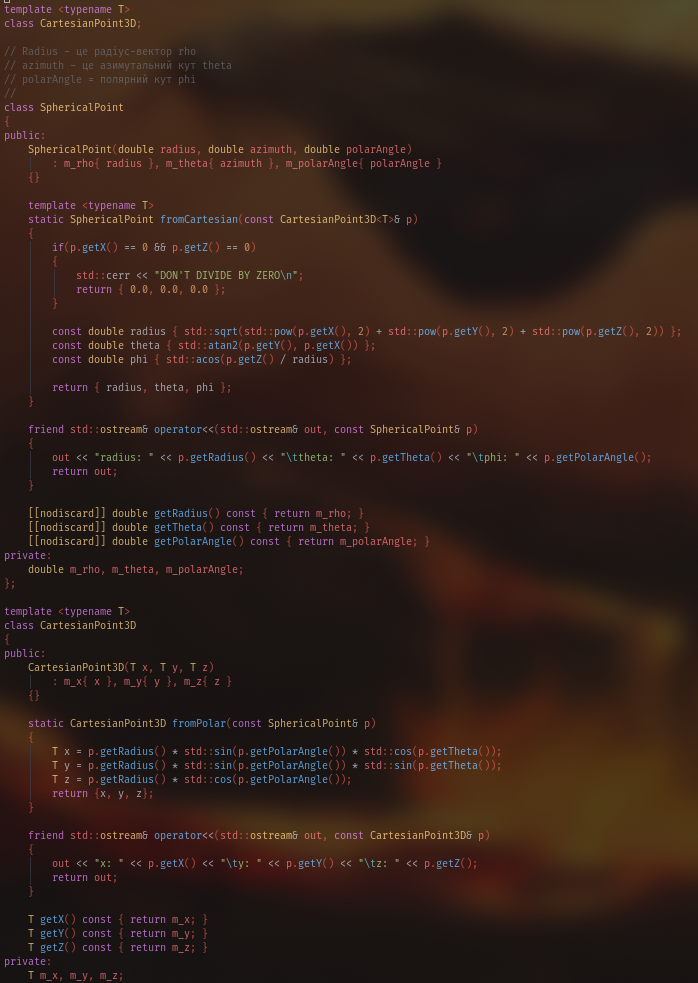
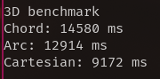

# Лабораторно-практичне заняття 1

Мета роботи:
1. Спроєктувати та реалізувати імутабельні програмні моделі для представлення точок у 2D та 3D системах координат.

2. Реалізувати механізми перетворення між декартовою, полярною та сферичною системами координат з використанням статичних фабричних методів.

3. Навчитись обчислювати відстані між точками, використовуючи різні математичні підходи.

4. Провести аналіз продуктивності обчислень для різних представлень даних.

## 1. Проєктування та реалізація імутабельних моделей даних
Необхідно спроєктувати та реалізувати імутабельні (immutable) класи або структури для представлення точок. Після створення об'єкта його стан (координати) не повинен змінюватися.

### 1.	Створіть наступні моделі даних:

- CartesianPoint2D(x, y)
- PolarPoint(radius, angle)
- CartesianPoint3D(x, y, z)
- SphericalPoint(radius, azimuth, polarAngle) (де radius - радіус-вектор $\rho$, azimuth - азимутальний кут $\theta$, polarAngle - полярний кут $\phi$)

### 2.	Реалізуйте статичні фабричні методи для перетворень між системами.

Приклад для 2D:

У класі CartesianPoint2D має бути метод public static CartesianPoint2D fromPolar(PolarPoint p).
У класі PolarPoint має бути метод public static PolarPoint fromCartesian(CartesianPoint2D p).

Аналогічно для 3D:

CartesianPoint3D.fromSpherical(SphericalPoint p)
SphericalPoint.fromCartesian(CartesianPoint3D p)




### 3.	Перевірка: Створіть кілька тестових точок, виконайте пряме та зворотне перетворення і переконайтесь, що початкові координати збігаються з кінцевими (з урахуванням похибки обчислень для чисел з плаваючою комою).

2D координати збігаються


3D координати збігаються


## 2. Реалізація обчислення відстаней
На основі реалізованих моделей даних, створіть функції для обчислення відстаней.

### 1.	Відстань у 2D-просторі:
- Напишіть функцію, що приймає два об'єкти CartesianPoint2D та обчислює між ними евклідову відстань.

- Напишіть функцію, що приймає два об'єкти PolarPoint та обчислює відстань безпосередньо у полярних координатах (за теоремою косинусів).

### 2.	Відстань у 3D-просторі (для точок, заданих у сферичних координатах):
Спосіб 1: Пряма відстань (хорда). Цей метод обчислює пряму відстань у 3D-просторі між двома точками, які можуть мати різні радіуси ()
Спосіб 2: Дугова відстань (по поверхні сфери). Цей метод обчислює відстань уздовж дуги великого кола. Він застосовується для пари точок, що розташовані на поверхні однієї сфери радіусом . 
```
template <typename T>
double distance2DCartesian(const CartesianPoint2D<T>& p1, const CartesianPoint2D<T>& p2)
{
    const double x = p2.getX() - p1.getX();
    const double y = p2.getY() - p1.getY();
    return std::sqrt(std::pow(x, 2) + std::pow(y, 2));
}

template <typename T>
double distance3DCartesian(const CartesianPoint3D<T>& p1, const CartesianPoint3D<T>& p2)
{
    const double x = p2.getX() - p1.getX();
    const double y = p2.getY() - p1.getY();
    const double z = p2.getZ() - p1.getZ();
    return std::sqrt(std::pow(x, 2) + std::pow(y, 2) + std::pow(z, 2));
}

double distance2DPolar(const PolarPoint& p1, const PolarPoint& p2)
{
    const double r1 = p1.getRadius();
    const double r2 = p2.getRadius();
    const double theta = p2.getTheta() - p1.getTheta();
    
    return std::sqrt(std::pow(r1, 2) + std::pow(r2, 2) - 2 * r1 * r2 * std::cos(theta));
}


double distance3DChord(const SphericalPoint& p1, const SphericalPoint& p2)
{
    const double r1 = p1.getRadius();
    const double r2 = p2.getRadius();
    const double theta1 = p1.getPolarAngle();
    const double theta2 = p2.getPolarAngle();
    const double phi1 = p1.getTheta();
    const double phi2 = p2.getTheta();
    
    
    return std::sqrt(std::pow(r1, 2) + std::pow(r2, 2) - 2 * r1 * r2 * (
                     std::sin(theta1) * std::sin(theta2) * std::cos(phi1 - phi2)
                     + std::cos(theta1) * std::cos(theta2)
    ));
}

double distance3DArc(const SphericalPoint& p1, const SphericalPoint& p2)
{
    const double radius = (p1.getRadius() + p2.getRadius()) / 2.0;
    
    const double phi1 = p1.getPolarAngle();
    const double phi2 = p2.getPolarAngle();
    const double theta1 = p1.getTheta();
    const double theta2 = p2.getTheta();
    
    
    return radius * std::acos(
        std::sin(phi1) * std::sin(phi2) 
        * std::cos(theta1 - theta2) 
        + std::cos(phi1) * std::cos(phi2)
    );
}
```

та код його тестів
```
    {
        const CartesianPoint2D<double> c1 {0.0, 2.0};
        const CartesianPoint2D<double> c2 {3.0, 4.0};
        const PolarPoint p1 { PolarPoint::fromCartesian(c1) };
        const PolarPoint p2 { PolarPoint::fromCartesian(c2) };
    
        std::cout << "Cartesian 2D distance: " << distance2DCartesian(c1, c2) << '\n';
        std::cout << "Polar 2D distance:\t\t" << distance2DPolar(p1, p2) << '\n';       
    }   

    {
        const SphericalPoint s1 {10.0, 0.5, 0.0};
        const SphericalPoint s2 {10.0, 1.5, 0.5};
        const CartesianPoint3D c1 = CartesianPoint3D<double>::fromSpherical(s1);
        const CartesianPoint3D c2 = CartesianPoint3D<double>::fromSpherical(s2);
    
        std::cout << "3D Chord distance:     " << distance3DChord(s1, s2) << '\n';
        std::cout << "3D Arc distance:       " << distance3DArc(s1, s2) << '\n';
        std::cout << "3D Cartesian distance: " << distance3DCartesian(c1, c2) << '\n';
    }
```

Результат

Можна побачити що він вірний.

## 3. Аналіз продуктивності (Бенчмаркінг)
Мета цієї частини — експериментально оцінити та порівняти обчислювальну вартість різних формул розрахунку відстані. Вимірювати слід виключно час виконання циклу обчислень, не враховуючи час на генерацію даних чи попередню конвертацію.

## 3.1. Бенчмарк для 2D-простору
### 1.	Підготовка даних:
Згенеруйте один масив з 100,000 (або більше) пар випадкових точок у полярній системі координат (PolarPoint).

```
template <std::size_t N>
void gen2DPolarData(std::vector<PolarPoint>& p1, std::vector<PolarPoint>& p2, std::mt19937& mt)
{
    std::uniform_real_distribution<double> range{0.0, 100.0};

    p1.clear();
    p2.clear();
    p1.reserve(N);
    p2.reserve(N);

    for (std::size_t i = 0; i < N; ++i)
    {
        p1.emplace_back(range(mt), range(mt));
        p2.emplace_back(range(mt), range(mt));
    }
}
```
Створіть другий масив, попередньо сконвертувавши кожну точку з першого масиву у декартову систему (CartesianPoint2D).
```
template <std::size_t N>
void polarToCartesian2D(const std::vector<PolarPoint>& p, std::vector<CartesianPoint2D<double>>& c)
{
    c.clear();
    c.reserve(N);
    for (std::size_t i = 0; i < N; ++i)
        c.emplace_back(CartesianPoint2D<double>::fromPolar(p[i]));
}
```

### 2.	Вимірювання чистого часу обчислень:
Підхід А (Полярні координати): Заміряйте час обчислення відстаней для всього масиву пар PolarPoint, використовуючи формулу на основі теореми косинусів.
Підхід Б (Декартові координати): Заміряйте час обчислення відстаней для всього масиву пар CartesianPoint2D, використовуючи стандартну евклідову формулу.

```
void thirdPart2D(std::mt19937& mt)
{
    std::vector<PolarPoint> p1, p2;
    gen2DPolarData<ARR_SIZE>(p1, p2, mt);

    std::vector<CartesianPoint2D<double>> c1, c2;
    polarToCartesian2D<ARR_SIZE>(p1, c1);
    polarToCartesian2D<ARR_SIZE>(p2, c2);

    std::cout << "2D benchmark\n";

    // A POLAR
    {
        const auto start = std::chrono::high_resolution_clock::now();
        for (std::size_t i = 0; i < ARR_SIZE; ++i)
            distance2DPolar(p1[i], p2[i]);

        const auto end = std::chrono::high_resolution_clock::now();
        const auto duration = std::chrono::duration_cast<std::chrono::microseconds>(end - start);
        std::cout << "Polar: " << duration.count() << " ms\n";
    }

    // B CARTESIAN
    {
        const auto start = std::chrono::high_resolution_clock::now();
        for (std::size_t i = 0; i < ARR_SIZE; ++i)
            distance2DCartesian(c1[i], c2[i]);

        const auto end = std::chrono::high_resolution_clock::now();
        const auto duration = std::chrono::duration_cast<std::chrono::microseconds>(end - start);
        std::cout << "Cartesian: " << duration.count() << " ms\n";
    }
}
```
Перевіряємо продуктивність 2D-простору


Та після декілька запусків отримав майже такій же результат, що дає нам висновок, що Декортава має середню швидкість виконання 
(6552 + 6554 + 6484 + 6866) / 4 = 6 614 мс навідміну від полярної зі своїими 7200+ стабільно


## 3.2. Бенчмарк для 3D-простору
### 1.	Підготовка даних:
Згенеруйте один масив з 100,000 (або більше) пар випадкових точок у сферичній системі (SphericalPoint). Умова: для кожної згенерованої пари точок (P1, P2) їх радіуси повинні бути однаковими (P1.radius == P2.radius), що є вимогою для коректного розрахунку дугової відстані. Радіуси для різних пар можуть відрізнятися.
Створіть другий масив, попередньо сконвертувавши кожну точку з першого масиву у декартову систему (CartesianPoint3D).

```

template <std::size_t N>
void gen3DSphericalData(std::vector<SphericalPoint>& s1, std::vector<SphericalPoint>& s2, std::mt19937& mt)
{
    std::uniform_real_distribution<double> range{0.0, 100.0};

    s1.clear();
    s2.clear();
    s1.reserve(N);
    s2.reserve(N);

    for (std::size_t i = 0; i < N; ++i)
    {
        double radius = range(mt);
        s1.emplace_back(radius, range(mt), range(mt));
        s2.emplace_back(radius, range(mt), range(mt));
    }
}

template <std::size_t N>
void sphericalToCartesian3D(const std::vector<SphericalPoint>& s, std::vector<CartesianPoint3D<double>>& c)
{
    c.clear();
    c.reserve(N);
    for (std::size_t i = 0; i < N; ++i)
        c.emplace_back(CartesianPoint3D<double>::fromSpherical(s[i]));
}
```

### 2.	Вимірювання чистого часу обчислень:
Підхід А (Сферична, хорда): Заміряйте час обчислення для масиву пар SphericalPoint, використовуючи формулу прямої відстані (хорди).
Підхід Б (Сферична, дуга): Заміряйте час обчислення для того ж масиву пар SphericalPoint, використовуючи формулу дугової відстані.
Підхід В (Декартова): Заміряйте час обчислення для масиву пар CartesianPoint3D, використовуючи стандартну евклідову відстань у 3D.

```
void thirdPart3D(std::mt19937& mt)
{
    std::vector<SphericalPoint> s1, s2;
    gen3DSphericalData<ARR_SIZE>(s1, s2, mt);

    std::vector<CartesianPoint3D<double>> c1, c2;
    sphericalToCartesian3D<ARR_SIZE>(s1, c1);
    sphericalToCartesian3D<ARR_SIZE>(s2, c2);

    std::cout << "3D benchmark\n";

    // A chord
    {
        const auto start = std::chrono::high_resolution_clock::now();
        for (std::size_t i = 0; i < ARR_SIZE; ++i)
            distance3DChord(s1[i], s2[i]);

        const auto end = std::chrono::high_resolution_clock::now();
        const auto duration = std::chrono::duration_cast<std::chrono::microseconds>(end - start);
        std::cout << "Chord: " << duration.count() << " ms\n";
    }

    // B Arc
    {
        const auto start = std::chrono::high_resolution_clock::now();
        for (std::size_t i = 0; i < ARR_SIZE; ++i)
            distance3DArc(s1[i], s2[i]);

        const auto end = std::chrono::high_resolution_clock::now();
        const auto duration = std::chrono::duration_cast<std::chrono::microseconds>(end - start);
        std::cout << "Arc: " << duration.count() << " ms\n";
    }

    // C Cartesian
    {
        const auto start = std::chrono::high_resolution_clock::now();
        for (std::size_t i = 0; i < ARR_SIZE; ++i)
            distance3DCartesian(c1[i], c2[i]);

        const auto end = std::chrono::high_resolution_clock::now();
        const auto duration = std::chrono::duration_cast<std::chrono::microseconds>(end - start);
        std::cout << "Cartesian: " << duration.count() << " ms\n";
    }
}
```

Перевіряємо продуктивність 3D-простору


Після декілька запусків можно зробии висновок що Декартова значно швидше виконується аніж дуга та хорда, між дугою і хордою разниця невелика але дуга швидше на ~1000мс стабільно. 

### Посилання на код
[LOON INSIDE OF THE FILE](./main.cpp)

# Висновок:
Навчився створювати імутабельні моделі даних, перетворювати системи координат і аналізувати швидкісобчислень відстаней у 2D I 3D просторах.
