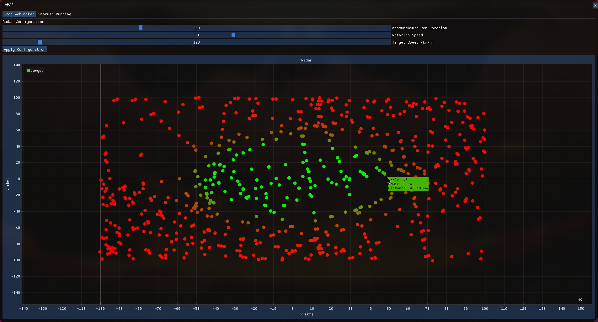

# Лабораторно-практичне заняття 2
Тема: 
Розробка додатку для візуалізації вимірювань радару

Мета роботи:
Розробити додаток, який зчитує дані з емульованої вимірювальної частини радару, наданої у вигляді Docker image, та відображає задетектовані цілі на графіку в полярних координатах. 

## 1. Завантаження та запуск емулятора вимірювальної частини радару:

- Завантажив Docker image з Docker hub використовуя наступну команду:

```docker pull iperekrestov/university:radar-emulation-service```

- Запустити Docker контейнер, використовуючи наступну команду:

```docker run --name radar-emulator -p 4000:4000 iperekrestov/university:radar-emulation-service```

Перевір, що працює


## 2. Підключення до сервісу через WebSocket

Через аргументи до запуску програми перевіряю чи є айпі то порт до вебсокету, якщо є то створюю дві перемених для хоста і порта і передаю їх у конструктор класу WebSocketClient

```int main(int argc, char** argv)
{
    if (argc != 3)
    {
        std::cerr << "<host> <port>\n";
        return EXIT_FAILURE;
    }

    const char* host = argv[1];
    const char* port = argv[2];

    WebSocketClient websocket{host, port};
```

WebSocketClient працює на окремому потоці, використовував для реалізації вебсокету на C++ бібліотеку Boost з його реалізацією вебсокету Boost.Beast, бібліотеки управління потоків, списків, строк зі стандартної бібліотеки C++, Також використовувалась бібліотеки json для парсінгу, з документації якої бралися приклади використання [посилання на бібліотеку json](https://github.com/nlohmann/json)

[Посилання на істочник приклада з документації бібліотеки Boost.Beast де брався код для реалізації підключення до вебсокету](https://www.boost.org/doc/libs/1_82_0/libs/beast/doc/html/beast/quick_start/websocket_client.html)


WebSocketClient.h
```
#ifndef LB2_WEBSOCKETCLIENT_H
#define LB2_WEBSOCKETCLIENT_H
#include <string>
#include <atomic>
#include <thread>
#include <mutex>
#include <list>

struct DockerData
{
    int angle;
    double power;
    double distanceKm;
};

class WebSocketClient
{
public:
    WebSocketClient(std::string host, std::string port);
    ~WebSocketClient();

    void Start();
    void Stop();

    [[nodiscard]] std::list<DockerData> GetData() const;
private:
    void Run();
    void JsonMessage(std::string_view msg);

private:
    std::string m_host, m_port;
    std::thread m_thread;
    mutable std::mutex m_mtx;
    std::atomic_bool is_running{ false };
    std::list<DockerData> m_data;
    int lastAngle{-1};
};

#endif //LB2_WEBSOCKETCLIENT_H
```

WebSocketClient.cpp
```
#include "WebSocketClient.h"
#include <utility>
#include <boost/beast/core.hpp>
#include <boost/beast/websocket.hpp>
#include <boost/asio/connect.hpp>
#include <boost/asio/ip/tcp.hpp>
#include <iostream>
#include <nlohmann/json.hpp>

namespace beast = boost::beast;         // from <boost/beast.hpp>
namespace http = beast::http;           // from <boost/beast/http.hpp>
namespace websocket = beast::websocket; // from <boost/beast/websocket.hpp>
namespace net = boost::asio;            // from <boost/asio.hpp>
using tcp = boost::asio::ip::tcp;       // from <boost/asio/ip/tcp.hpp>
using json = nlohmann::json;            // from <nlohmann/json.hpp>

#define LIGHTSPEED 300000

WebSocketClient::WebSocketClient(std::string host, std::string port)
    : m_host{ std::move(host) }, m_port{ std::move(port) }
{
}

WebSocketClient::~WebSocketClient()
{
    Stop();
}

void WebSocketClient::Start()
{
    if(!is_running)
    {
        is_running = true;
        m_thread = std::thread(&WebSocketClient::Run, this);
    }
}

void WebSocketClient::Stop()
{
    is_running = false;
    if (m_thread.joinable())
        m_thread.join();
}

std::list<DockerData> WebSocketClient::GetData() const
{
    std::unique_lock<std::mutex> lock(m_mtx);
    return m_data;
}

void WebSocketClient::Run()
{
    try
    {
        // The io_context is required for all I/O
        net::io_context ioc;

        // These objects perform our I/O
        tcp::resolver resolver{ioc};
        websocket::stream<tcp::socket> ws{ioc};

        // Look up the domain name
        auto const results = resolver.resolve(m_host, m_port);

        // Make the connection on the IP address we get from a lookup
        net::connect(ws.next_layer(), results);

        // Perform the websocket handshake
        ws.handshake(m_host + ":" + m_port, "/");

        // Continuous read loop
        while (is_running)
        {
            beast::flat_buffer buffer;
            ws.read(buffer);
            std::string msg = beast::buffers_to_string(buffer.data());

            JsonMessage(msg);
        }

        ws.close(websocket::close_code::normal);
        std::cout << "Websocket stopped\n";
    }
    catch(std::exception& e)
    {
        std::cerr << "Error: " << e.what() << std::endl;
    }
}


void WebSocketClient::JsonMessage(std::string_view msg)
{
    try
    {
        json j = json::parse(msg);

        if (!j.contains("scanAngle") && !j.contains("echoResponses"))
            throw std::runtime_error("Invalid JSON");

        int scanAngle = j["scanAngle"].get<int>();

        if (scanAngle == lastAngle)
            return;

        lastAngle = scanAngle;

        auto& echoes = j["echoResponses"];

        if (!echoes.is_array())
            throw std::runtime_error("echoREspone isn't an array");


        for (auto& echo : echoes)
        {
            double time = echo["time"];
            double power = echo["power"];
            double distanceKm = LIGHTSPEED * time / 2.0;

            // std::cout << "Angle: " << scanAngle
            //           << "\tDistance: " << distanceKm
            //           << "\tPower: " << power << '\n';

            std::unique_lock<std::mutex> lock(m_mtx);
            m_data.push_back( {scanAngle, power, distanceKm} );

            if (m_data.size() > 1000)
                m_data.pop_front();
        }
    }
    catch (std::exception& e)
    {
        std::cerr << "JSON parse error: " << e.what() << '\n';
    }
}
```

## 3. Обробка, візуалізація даних та налаштування графіка

Для відображення вікна використовується бібліотека SDL3, для рендера використовується OpenGl API.
Для цього проекту я вирішив замінити усе вікно SDL на вікно ImGui(що є іншою бібліотекою для реалізації графічного інтерфейсу для юзера, яку можна рендерити будь-де у 3д пайплайні). Для графіку використовував бібліотеку/доповнення для ImGui під назвою ImPlot. 

Частина коду налаштування SDL3 з OpenGl та ImGui взята з [посилання](https://github.com/ocornut/imgui/blob/master/examples/example_sdl3_opengl3/main.cpp)

Дані оброблені через веб-сокет отримаємо за допомогою websocket.GetData(), та переводемо їх у поляррну систему використовуючи код з Лабораторно-практичої роботи 1.
Та оскільки, координати будуть показуватися на x,y графіку, то потрібно перевести з полярної системи у декартову і після відображати дані.

```
std::list<DockerData> list{websocket.GetData()};

            std::vector<double> x_coords;
            std::vector<double> y_coords;

            for (const auto& data : list)
            {
                double angleRad = data.angle * (PI / 180.0);

                PolarPoint polar(data.distanceKm, angleRad);
                CartesianPoint2D<double> cartesian = CartesianPoint2D<double>::fromPolar(polar);

                x_coords.push_back(cartesian.getX());
                y_coords.push_back(cartesian.getY());
            }
```

Відстань відображається у кілометрах на координатної осі 
```
            if (ImPlot::BeginPlot("Radar", ImVec2(-1, -1)))
            {
                ImPlot::SetupAxes("X (km)", "Y (km)");
                ImPlot::SetupAxisLimits(ImAxis_X1, -250, 250);
                ImPlot::SetupAxisLimits(ImAxis_Y1, -250, 250);
```

та додана можливість змінювати конфігурацію за допомоги API запитів використовуя встановленний в системі curl
```
            ImGui::Text("Radar Configuration");
            static int measurementsPerRotation { 360 };
            static int rotationSpeed { 60 };
            static int targetSpeed { 100 };

            ImGui::SliderInt("Measurements Per Rotation", &measurementsPerRotation, 10, 1000);
            ImGui::SliderInt("Rotation Speed ", &rotationSpeed, 1, 100);
            ImGui::SliderInt("Target Speed (km/h)", &targetSpeed, 10, 1000);

            if (ImGui::Button("Apply Configuration"))
            {
                std::string cmd = "curl -X PUT http://localhost:4000/config -H \"Content-Type: application/json\" -d '{";
                cmd += "\"measurementsPerRotation\":" + std::to_string(measurementsPerRotation) + ",";
                cmd += "\"rotationSpeed\":" + std::to_string(rotationSpeed) + ",";
                cmd += "\"targetSpeed\":" + std::to_string(targetSpeed);
                cmd += "}'";
                system(cmd.c_str());
            }
```


main.cpp
```
#include <iostream>

#include "imgui.h"
#include "imgui_impl_sdl3.h"
#include "imgui_impl_opengl3.h"
#include <SDL3/SDL.h>

#include "CoordinateSystems.h"
#include "WebSocketClient.h"
#include "third-party/implot/implot.h"
#include "third-party/implot/implot_internal.h"
#if defined(IMGUI_IMPL_OPENGL_ES2)
#include <SDL3/SDL_opengles2.h>
#else
#include <SDL3/SDL_opengl.h>
#endif

#define PI 3.14

#include <vector>

ImVec2 GetWindowSize(SDL_Window* window)
{
    int w, h;
    SDL_GetWindowSize(window, &w, &h);
    return {static_cast<float>(w), static_cast<float>(h)};
}

// Main code
int main(int argc, char** argv)
{
    if (argc != 3)
    {
        std::cerr << "<host> <port>\n";
        return EXIT_FAILURE;
    }

    const char* host = argv[1];
    const char* port = argv[2];

    WebSocketClient websocket{host, port};

    // Setup SDL
    // [If using SDL_MAIN_USE_CALLBACKS: all code below until the main loop starts would likely be your SDL_AppInit() function]
    if (!SDL_Init(SDL_INIT_VIDEO | SDL_INIT_GAMEPAD))
    {
        printf("Error: SDL_Init(): %s\n", SDL_GetError());
        return EXIT_FAILURE;
    }

    // Decide GL+GLSL versions
#if defined(IMGUI_IMPL_OPENGL_ES2)
    // GL ES 2.0 + GLSL 100 (WebGL 1.0)
    const char* glsl_version = "#version 100";
    SDL_GL_SetAttribute(SDL_GL_CONTEXT_FLAGS, 0);
    SDL_GL_SetAttribute(SDL_GL_CONTEXT_PROFILE_MASK, SDL_GL_CONTEXT_PROFILE_ES);
    SDL_GL_SetAttribute(SDL_GL_CONTEXT_MAJOR_VERSION, 2);
    SDL_GL_SetAttribute(SDL_GL_CONTEXT_MINOR_VERSION, 0);
#elif defined(IMGUI_IMPL_OPENGL_ES3)
    // GL ES 3.0 + GLSL 300 es (WebGL 2.0)
    const char* glsl_version = "#version 300 es";
    SDL_GL_SetAttribute(SDL_GL_CONTEXT_FLAGS, 0);
    SDL_GL_SetAttribute(SDL_GL_CONTEXT_PROFILE_MASK, SDL_GL_CONTEXT_PROFILE_ES);
    SDL_GL_SetAttribute(SDL_GL_CONTEXT_MAJOR_VERSION, 3);
    SDL_GL_SetAttribute(SDL_GL_CONTEXT_MINOR_VERSION, 0);
#elif defined(__APPLE__)
    // GL 3.2 Core + GLSL 150
    const char* glsl_version = "#version 150";
    SDL_GL_SetAttribute(SDL_GL_CONTEXT_FLAGS, SDL_GL_CONTEXT_FORWARD_COMPATIBLE_FLAG); // Always required on Mac
    SDL_GL_SetAttribute(SDL_GL_CONTEXT_PROFILE_MASK, SDL_GL_CONTEXT_PROFILE_CORE);
    SDL_GL_SetAttribute(SDL_GL_CONTEXT_MAJOR_VERSION, 3);
    SDL_GL_SetAttribute(SDL_GL_CONTEXT_MINOR_VERSION, 2);
#else
    // GL 3.0 + GLSL 130
    const char* glsl_version = "#version 130";
    SDL_GL_SetAttribute(SDL_GL_CONTEXT_FLAGS, 0);
    SDL_GL_SetAttribute(SDL_GL_CONTEXT_PROFILE_MASK, SDL_GL_CONTEXT_PROFILE_CORE);
    SDL_GL_SetAttribute(SDL_GL_CONTEXT_MAJOR_VERSION, 3);
    SDL_GL_SetAttribute(SDL_GL_CONTEXT_MINOR_VERSION, 0);
#endif

    // Create window with graphics context
    SDL_GL_SetAttribute(SDL_GL_DOUBLEBUFFER, 1);
    SDL_GL_SetAttribute(SDL_GL_DEPTH_SIZE, 24);
    SDL_GL_SetAttribute(SDL_GL_STENCIL_SIZE, 8);
    float main_scale = SDL_GetDisplayContentScale(SDL_GetPrimaryDisplay());
    SDL_WindowFlags window_flags = SDL_WINDOW_OPENGL | SDL_WINDOW_RESIZABLE | SDL_WINDOW_HIDDEN | SDL_WINDOW_HIGH_PIXEL_DENSITY | SDL_WINDOW_BORDERLESS;
    constexpr const char* window_name{"LABA2"};
    SDL_Window* window = SDL_CreateWindow(window_name, (int)(1280 * main_scale), (int)(800 * main_scale), window_flags);
    if (window == nullptr)
    {
        printf("Error: SDL_CreateWindow(): %s\n", SDL_GetError());
        return 1;
    }
    SDL_GLContext gl_context = SDL_GL_CreateContext(window);
    if (gl_context == nullptr)
    {
        printf("Error: SDL_GL_CreateContext(): %s\n", SDL_GetError());
        return 1;
    }

    SDL_GL_MakeCurrent(window, gl_context);
    SDL_GL_SetSwapInterval(1); // Enable vsync
    SDL_SetWindowPosition(window, SDL_WINDOWPOS_CENTERED, SDL_WINDOWPOS_CENTERED);
    SDL_ShowWindow(window);

    // Setup Dear ImGui context
    IMGUI_CHECKVERSION();
    ImGui::CreateContext();
    ImPlot::CreateContext();
    ImGuiIO& io = ImGui::GetIO(); (void)io;
    io.ConfigFlags |= ImGuiConfigFlags_NavEnableKeyboard;     // Enable Keyboard Controls
    io.ConfigFlags |= ImGuiConfigFlags_NavEnableGamepad;      // Enable Gamepad Controls
    io.ConfigFlags |= ImGuiConfigFlags_DockingEnable;         // Enable Docking
    io.ConfigFlags |= ImGuiConfigFlags_ViewportsEnable;       // Enable Multi-Viewport / Platform Windows
    //io.ConfigViewportsNoAutoMerge = true;
    //io.ConfigViewportsNoTaskBarIcon = true;

    // Setup Dear ImGui style
    ImGui::StyleColorsDark();
    //ImGui::StyleColorsLight();

    // Setup scaling
    ImGuiStyle& style = ImGui::GetStyle();
    style.ScaleAllSizes(main_scale);        // Bake a fixed style scale. (until we have a solution for dynamic style scaling, changing this requires resetting Style + calling this again)
    style.FontScaleDpi = main_scale;        // Set initial font scale. (using io.ConfigDpiScaleFonts=true makes this unnecessary. We leave both here for documentation purpose)
    io.ConfigDpiScaleFonts = true;          // [Experimental] Automatically overwrite style.FontScaleDpi in Begin() when Monitor DPI changes. This will scale fonts but _NOT_ scale sizes/padding for now.
    io.ConfigDpiScaleViewports = true;      // [Experimental] Scale Dear ImGui and Platform Windows when Monitor DPI changes.

    // When viewports are enabled we tweak WindowRounding/WindowBg so platform windows can look identical to regular ones.
    if (io.ConfigFlags & ImGuiConfigFlags_ViewportsEnable)
    {
        style.WindowRounding = 0.0f;
        style.Colors[ImGuiCol_WindowBg].w = 1.0f;
    }

    // Setup Platform/Renderer backends
    ImGui_ImplSDL3_InitForOpenGL(window, gl_context);
    ImGui_ImplOpenGL3_Init(glsl_version);

    // Main loop
    bool done = false;
    while (!done)
    {
        // Poll and handle events (inputs, window resize, etc.)
        // You can read the io.WantCaptureMouse, io.WantCaptureKeyboard flags to tell if dear imgui wants to use your inputs.
        // - When io.WantCaptureMouse is true, do not dispatch mouse input data to your main application, or clear/overwrite your copy of the mouse data.
        // - When io.WantCaptureKeyboard is true, do not dispatch keyboard input data to your main application, or clear/overwrite your copy of the keyboard data.
        // Generally you may always pass all inputs to dear imgui, and hide them from your application based on those two flags.
        // [If using SDL_MAIN_USE_CALLBACKS: call ImGui_ImplSDL3_ProcessEvent() from your SDL_AppEvent() function]
        SDL_Event event;
        while (SDL_PollEvent(&event))
        {
            ImGui_ImplSDL3_ProcessEvent(&event);
            if (event.type == SDL_EVENT_QUIT)
                done = true;
            if (event.type == SDL_EVENT_WINDOW_CLOSE_REQUESTED && event.window.windowID == SDL_GetWindowID(window))
                done = true;
        }

        // [If using SDL_MAIN_USE_CALLBACKS: all code below would likely be your SDL_AppIterate() function]
        if (SDL_GetWindowFlags(window) & SDL_WINDOW_MINIMIZED)
        {
            SDL_Delay(10);
            continue;
        }

        // Start the Dear ImGui frame
        ImGui_ImplOpenGL3_NewFrame();
        ImGui_ImplSDL3_NewFrame();
        ImGui::NewFrame();

        // Set IMGUI window size to viewport size
        ImGui::SetNextWindowSize(GetWindowSize(window));
        ImGui::SetNextWindowPos({0,0});

        // Main Window
        {
            ImGui::Begin("window", nullptr, ImGuiWindowFlags_NoTitleBar);
            ImGui::Text(window_name); // Custom title name

            ImGui::SameLine(ImGui::GetContentRegionAvail().x); // pusht o the right side
            if (ImGui::Button("X"))
                done = true;

            ImGui::Separator();

            // WEBSOCKET IS HERE
            static bool websocketRunning = false;
            if (ImGui::Button(websocketRunning ? "Stop WebSocket" : "Start WebSocket"))
            {
                websocketRunning = !websocketRunning;
                if (websocketRunning)
                    websocket.Start();
                else
                    websocket.Stop();
            }

            ImGui::SameLine();
            ImGui::Text(websocketRunning ? "Status: Running" : "Status: Stopped");

            ImGui::Separator();

            // RADARCONF
            ImGui::Text("Radar Configuration");
            static int measurementsPerRotation { 360 };
            static int rotationSpeed { 60 };
            static int targetSpeed { 100 };

            ImGui::SliderInt("Measurements Per Rotation", &measurementsPerRotation, 10, 1000);
            ImGui::SliderInt("Rotation Speed ", &rotationSpeed, 1, 100);
            ImGui::SliderInt("Target Speed (km/h)", &targetSpeed, 10, 1000);

            if (ImGui::Button("Apply Configuration"))
            {
                std::string cmd = "curl -X PUT http://localhost:4000/config -H \"Content-Type: application/json\" -d '{";
                cmd += "\"measurementsPerRotation\":" + std::to_string(measurementsPerRotation) + ",";
                cmd += "\"rotationSpeed\":" + std::to_string(rotationSpeed) + ",";
                cmd += "\"targetSpeed\":" + std::to_string(targetSpeed);
                cmd += "}'";
                system(cmd.c_str());
            }

            ImGui::Separator();

            std::list<DockerData> list{websocket.GetData()};

            std::vector<double> x_coords;
            std::vector<double> y_coords;

            for (const auto& data : list)
            {
                double angleRad = data.angle * (PI / 180.0);

                PolarPoint polar(data.distanceKm, angleRad);
                CartesianPoint2D<double> cartesian = CartesianPoint2D<double>::fromPolar(polar);

                x_coords.push_back(cartesian.getX());
                y_coords.push_back(cartesian.getY());
            }

            if (ImPlot::BeginPlot("Radar", ImVec2(-1, -1)))
            {
                ImPlot::SetupAxes("X (km)", "Y (km)");
                ImPlot::SetupAxisLimits(ImAxis_X1, -200, 200);
                ImPlot::SetupAxisLimits(ImAxis_Y1, -200, 200);

                if (!x_coords.empty())
                {
                    // Is this code bad? Yes
                    // Should I fix it? Definitely yes
                    // Will I do it? Absolutely not
                    std::size_t i{ 0 };
                    for (const auto& data : list)
                    {
                        const float power { static_cast<float>(data.power) };
                        ImVec4 color { 1.0f - power, power, 0.0f, 1.0f };

                        ImPlot::SetNextMarkerStyle(ImPlotMarker_Circle, 5, color, IMPLOT_AUTO, color);
                        ImPlot::PlotScatter("target", &x_coords[i], &y_coords[i], 1);

                        if (ImPlot::IsPlotHovered())
                        {
                            ImPlotPoint mouse = ImPlot::GetPlotMousePos();
                            double dx = x_coords[i] - mouse.x;
                            double dy = y_coords[i] - mouse.y;
                            double dist = std::sqrt(dx*dx + dy*dy);

                            if (dist < 5.0)
                            {
                                ImPlot::Annotation(x_coords[i], y_coords[i], color, ImVec2(10,10), false,
                                    "Angle: %d°\nPower: %.2f\nDistance: %.2f km",
                                    data.angle, data.power, data.distanceKm);
                            }
                        }

                        ++i;
                    }
                }

                ImPlot::EndPlot();
            }


            ImGui::End();
        }

        // Rendering
        ImGui::Render();
        glViewport(0, 0, (int)io.DisplaySize.x, (int)io.DisplaySize.y);
        glClearColor(0, 0, 0, 1);
        glClear(GL_COLOR_BUFFER_BIT);
        ImGui_ImplOpenGL3_RenderDrawData(ImGui::GetDrawData());

        // Update and Render additional Platform Windows
        // (Platform functions may change the current OpenGL context, so we save/restore it to make it easier to paste this code elsewhere.
        //  For this specific demo app we could also call SDL_GL_MakeCurrent(window, gl_context) directly)
        if (io.ConfigFlags & ImGuiConfigFlags_ViewportsEnable)
        {
            SDL_Window* backup_current_window = SDL_GL_GetCurrentWindow();
            SDL_GLContext backup_current_context = SDL_GL_GetCurrentContext();
            ImGui::UpdatePlatformWindows();
            ImGui::RenderPlatformWindowsDefault();
            SDL_GL_MakeCurrent(backup_current_window, backup_current_context);
        }

        SDL_GL_SwapWindow(window);
    }

    // Cleanup
    // [If using SDL_MAIN_USE_CALLBACKS: all code below would likely be your SDL_AppQuit() function]
    ImGui_ImplOpenGL3_Shutdown();
    ImGui_ImplSDL3_Shutdown();
    ImPlot::DestroyContext();
    ImGui::DestroyContext();

    SDL_GL_DestroyContext(gl_context);
    SDL_DestroyWindow(window);
    SDL_Quit();

    return EXIT_SUCCESS;
}
```

Вікно працючого додатка



# Висновок
Навчився розробляти додаток, який зчитує дані з емульованої вимірювальної частини радару інформацію через Docker container з використанням веб-сокету та бібліотек Boost.Beast і nlohmann/json.
Навчився відображати інформацію на графику полярних координатах використовуючи бібліотеки ImGui та ImPlot.
