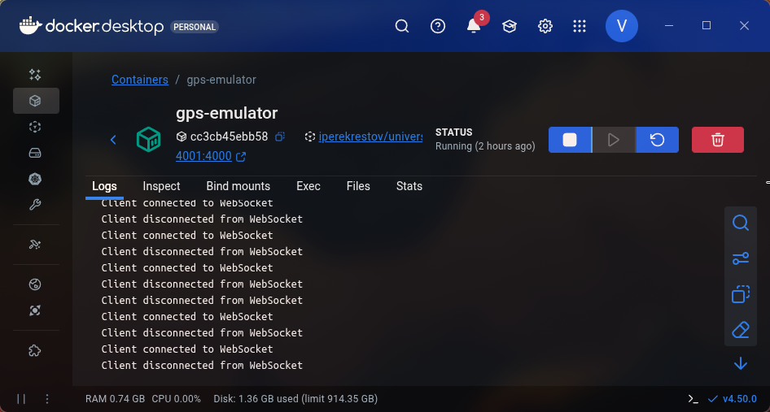
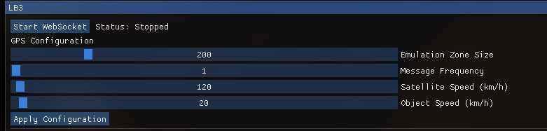
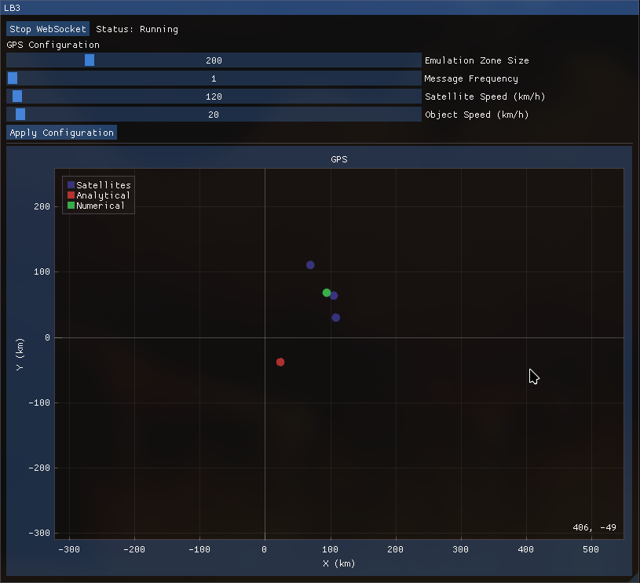

# Лабораторно-практичне заняття 3
Тема: 
Розробка додатку для візуалізації вимірювань GPS

Мета роботи:
Розробити веб-додаток, який зчитує дані з емульованої вимірювальної частини GPS,
розраховує положення об'єкта двома методами (аналітичним та чисельним) та
відображає положення об'єкта і супутників на графіку в декартових координатах.

Теоретичні відомості
Для виконання роботи ви будете спиратися на два підходи до розв'язання задачі
трилатерації:
1.​ Аналітичний метод. Це метод прямого розв'язання системи рівнянь кіл, як описано
в початковому тексті лабораторної роботи. Він дає точний результат для ідеальних
даних.
2.​ Чисельний метод. Цей підхід не розв'язує систему рівнянь, а натомість шукає таку
точку (x, y), яка мінімізує сумарну похибку між виміряними та розрахованими
відстанями до супутників. Цей метод є більш стійким до похибок у реальних даних.
Для його реалізації можна як скористатися готовими математичними бібліотеками,
так і написати власну реалізацію алгоритму мінімізації.

## 1. Завантаження та запуск емулятора вимірювальної частини GPS:


- Завантажив Docker image з Docker hub використовуя наступну команду:

```docker pull iperekrestov/university:gps-emulation-service```

- Запустити Docker контейнер, використовуючи наступну команду:

```docker run --name gps-emulator -p 4001:4000 iperekrestov/university:gps-emulation-service```

Перевір, що працює



## 2. Зміна параметрів через API:

Параметри змінюються через інтерфейс ImGui отправляючи POST запит curl використовуючи його системну інсталляцію, після натискання кнопки Apply Configuration



```
    void LB3::ChangeParameters()
    {
        ImGui::Text("GPS Configuration");

        ImGui::SliderInt("Emulation Zone Size", &emulationZoneSize, 10, 1000);
        ImGui::SliderInt("Message Frequency ", &messageFrequency, 1, 100);
        ImGui::SliderInt("Satellite Speed (km/h)", &satelliteSpeed, 1, 10000);
        ImGui::SliderInt("Object Speed (km/h)", &objectSpeed, 1, 1000);

        if (ImGui::Button("Apply Configuration"))
        {
            std::string cmd = "curl -X POST http://localhost:4001/config -H \"Content-Type: application/json\" -d '{";
            cmd += "\"emulationZoneSize\":{\"width\":" + std::to_string(emulationZoneSize) + ",\"height\":" + std::to_string(emulationZoneSize) + "},";
            cmd += "\"messageFrequency\":" + std::to_string(messageFrequency) + ",";
            cmd += "\"satelliteSpeed\":" + std::to_string(satelliteSpeed) + ",";
            cmd += "\"objectSpeed\":" + std::to_string(objectSpeed);
            cmd += "}'";

            system(cmd.c_str());
        }
    }
```

WebSocketClient використовується з попередньої практичної роботи


WebSocketClient.h
```
#ifndef LB2_WEBSOCKETCLIENT_H
#define LB2_WEBSOCKETCLIENT_H
#include <string>
#include <atomic>
#include <thread>
#include <mutex>
#include <list>
#include <functional>

class WebSocketClient
{
public:
    /**
     *
     * @param host IP address of the websocket server
     * @param port Port that server uses
     * @param messageFunction Function that's being called during getting a message
     */
    WebSocketClient(std::string host, std::string port, const std::function<void(const std::string&)>& messageFunction);
    ~WebSocketClient();

    void Start();
    void Stop();

    // [[nodiscard]] std::string GetMessage() const;
    [[nodiscard]] bool IsRunning() const { return is_running.load(); }
private:
    void Run();

private:
    std::string m_host, m_port;
    std::thread m_thread;
    // mutable std::mutex m_mtx;
    std::atomic_bool is_running{ false };
    std::function<void(const std::string&)> m_messageFunction;
    // std::string m_message;
};

#endif //LB2_WEBSOCKETCLIENT_H
```

WebSocketClient.cpp
```
#include "WebSocketClient.h"
#include <utility>
#include <boost/beast/core.hpp>
#include <boost/beast/websocket.hpp>
#include <boost/asio/connect.hpp>
#include <boost/asio/ip/tcp.hpp>
#include <iostream>

namespace beast = boost::beast;         // from <boost/beast.hpp>
namespace http = beast::http;           // from <boost/beast/http.hpp>
namespace websocket = beast::websocket; // from <boost/beast/websocket.hpp>
namespace net = boost::asio;            // from <boost/asio.hpp>
using tcp = boost::asio::ip::tcp;       // from <boost/asio/ip/tcp.hpp>

WebSocketClient::WebSocketClient(std::string host, std::string port, const std::function<void(const std::string&)>& messageFunction)
    : m_host{ std::move(host) }, m_port{ std::move(port) }, m_messageFunction{ messageFunction }
{
}

WebSocketClient::~WebSocketClient()
{
    Stop();
}

void WebSocketClient::Start()
{
    if(!is_running)
    {
        if (m_thread.joinable())
            m_thread.join();

        is_running = true;
        m_thread = std::thread(&WebSocketClient::Run, this);
    }
}

void WebSocketClient::Stop()
{
    is_running.store(false);

    if (m_thread.joinable())
        m_thread.join();
}

// std::string WebSocketClient::GetMessage() const
// {
//     std::unique_lock<std::mutex> lock(m_mtx);
//     return m_message;
// }

void WebSocketClient::Run()
{
    try
    {
        // The io_context is required for all I/O
        net::io_context ioc;

        // These objects perform our I/O
        tcp::resolver resolver{ioc};
        websocket::stream<tcp::socket> ws{ioc};

        // Look up the domain name
        auto const results = resolver.resolve(m_host, m_port);

        // Make the connection on the IP address we get from a lookup
        net::connect(ws.next_layer(), results);

        // Perform the websocket handshake
        ws.handshake(m_host + ":" + m_port, "/");

        is_running = true;

        // Continuous read loop
        while (is_running.load())
        {
            beast::flat_buffer buffer;
            ws.read(buffer);
            std::string msg = beast::buffers_to_string(buffer.data());
            m_messageFunction(msg);

        }

        ws.close(websocket::close_code::normal);
        std::cout << "Websocket stopped\n";
    }
    catch(std::exception& e)
    {
        std::cerr << "Error: " << e.what() << std::endl;
    }

    is_running = false;
}
```

## 3. Формат повідомлень, що надсилаються через WebSocket:

Дані, які надсилаються через WebSocket з емульованої частини GPS, містять
інформацію про положення супутників та об'єкта. Повідомлення представляються у
форматі JSON і мають наступну структуру:

```
{​
"id": "uuid",​
"x": 100.5,​
"y": 200.3,​
"sentAt": 1692170400000,​
"receivedAt": 1692170400100​
}
```
-​ id: Унікальний ідентифікатор супутника (UUID).
-​
 x, y: Координати супутника у декартових координатах (кілометри).
-​
 sentAt: Час відправки повідомлення супутником (мілісекунди з початку
епохи Unix).
-​
 receivedAt: Час отримання повідомлення об'єктом (мілісекунди з початку
епохи Unix).

Аналітичний розрахунок виконується в функції LB3::CalculateAnalytical()
Чисельний розрахунок виконується в функції LB3::CalculateNumerical()
Обидва результати відображаються на графіку

Код програми
```
#ifndef COORDSYSTEM_LB3_H
#define COORDSYSTEM_LB3_H

#include "Core/Layer.h"
#include "WebSocketClient.h"

#include "imgui.h"

namespace App
{
    class LB3 final : public Core::Layer
    {
    public:
        /**
        * @param id: Унікальний ідентифікатор супутника (UUID).
        * @param xy: Координати супутника у декартових координатах (кілометри).
        * @param sentAt: Час відправки повідомлення супутником (мілісекунди з початку епохи Unix).
        * @param receivedAt: Час отримання повідомлення об'єктом (мілісекунди з початку епохи Unix).
        */
        struct SatelliteData
        {
            float x;
            float y;
            long double sentAt;
            long double receivedAt;

            [[nodiscard]] float GetDistance() const;
        };

        struct ObjectPosition
        {
            float x;
            float y;
        };

    public:
        LB3();
        ~LB3() override;
        void OnUpdate() override;
        void OnImGuiRender() override;

    private:
        void WebSocketButton();
        void ChangeParameters();
        void ShowGPS();
        void OnImPlotHover(const float x, const float y, const ImVec4 color = { 0.0f, 0.0f, 0.0f, 1.0f });
        void HandleMessage(const std::string& msg);

        /**
        * @param Використовується трилитерація
        */
        std::optional<ObjectPosition> CalculateAnalytical();

        /**
        * @param Використовується трилитерація
        */
        std::optional<ObjectPosition> CalculateNumerical();
    private:
        int emulationZoneSize { 200 };
        int messageFrequency { 1 };
        int satelliteSpeed { 120 };
        int objectSpeed { 20 };
        std::vector<std::pair<std::string, SatelliteData>> m_satellitesData;
        std::vector<std::pair<std::string, SatelliteData>> m_satellitesDataCopy;

        std::optional<ObjectPosition> m_analyticalPosition;
        std::optional<ObjectPosition> m_numericalPosition;

        std::unique_ptr<WebSocketClient> websocket;
        mutable std::mutex m_mtx;
    };
}

#endif //COORDSYSTEM_LB3_H

#include "LB3.h"

#include "CoordinateSystems.h"
#include "imgui.h"

#include <nlohmann/json.hpp>
#include <SDL3/SDL_time.h>

#include "implot.h"
using json = nlohmann::json;            // from <nlohmann/json.hpp>

#include <chrono>

uint64_t getUnixTimeMs() {
    return static_cast<uint64_t>(
        std::chrono::duration_cast<std::chrono::milliseconds>(
            std::chrono::system_clock::now().time_since_epoch()
        ).count()
    );
}

namespace App
{
    void LB3::HandleMessage(const std::string& msg)
    {
        try
        {
            json j = json::parse(msg);

            if (j.is_null())
                return;

            if (!j.contains("id") && !j.contains("x")
                && !j.contains("y") && !j.contains("sentAt")
                && !j.contains("receivedAt"))
            {
                throw std::runtime_error("Invalid JSON");
            }


            const std::string id = j["id"];
            SatelliteData data
            {
                j["x"],
                j["y"],
                j["sentAt"],
                j["receivedAt"]
            };


            std::lock_guard<std::mutex> lock(m_mtx);

            const auto it = std::ranges::find_if(m_satellitesData,
                                                 [&id](const auto& p){ return p.first == id; });

            if (it != m_satellitesData.end())
            {
                it->second = data;
            }
            else
            {
                m_satellitesData.emplace_back(id, data);

                if (m_satellitesData.size() > 3)
                    m_satellitesData.erase(m_satellitesData.begin());
            }
        }
        catch (std::exception& e)
        {
            std::cerr << "JSON parse error: " << e.what() << '\n';
        }
    }

    std::optional<LB3::ObjectPosition> LB3::CalculateAnalytical()
    {
        if (m_satellitesDataCopy.size() < 3)
            return std::nullopt;

        auto it = m_satellitesDataCopy.begin();
        SatelliteData s1 = it->second;
        ++it;
        SatelliteData s2 = it->second;
        ++it;
        SatelliteData s3 = it->second;

        double x1 = s1.x, y1 = s1.y, r1 = s1.GetDistance();
        double x2 = s2.x, y2 = s2.y, r2 = s2.GetDistance();
        double x3 = s3.x, y3 = s3.y, r3 = s3.GetDistance();

        double A = 2 * (x2 - x1);
        double B = 2 * (y2 - y1);
        double C = r1*r1 - r2*r2 - x1*x1 - y1*y1 + x2*x2 + y2*y2;

        double D = 2 * (x3 - x2);
        double E = 2 * (y3 - y2);
        double F = r2*r2 - r3*r3 - x2*x2 - y2*y2 + x3*x3 + y3*y3;

        double denominator1 = (E * A - B * D);
        double denominator2 = (B * D - A * E);

        if (denominator1 == 0 || denominator2 == 0)
            return std::nullopt;

        double x = (C * E - F * B) / denominator1;
        double y = (C * D - A * F) / denominator2;

        if (std::isnan(x) || std::isnan(y))
            return std::nullopt;

        return ObjectPosition(static_cast<float>(x), static_cast<float>(y));
    }

    std::optional<LB3::ObjectPosition> LB3::CalculateNumerical()
    {
        if (m_satellitesDataCopy.size() < 3)
            return std::nullopt;

        auto gradient = [this](float x, float y)
        {
            float gx = 0.0f, gy = 0.0f;
            for (const auto& [id, sat] : m_satellitesDataCopy)
            {
                const float dx = x - sat.x;
                const float dy = y - sat.y;
                const float calc_r = std::sqrt(dx*dx + dy*dy);
                if (calc_r == 0) continue;

                const float diff = calc_r - sat.GetDistance();
                gx += 2.0f * diff * dx / calc_r;
                gy += 2.0f * diff * dy / calc_r;
            }
            return std::pair<float, float>{gx, gy};
        };

        float x = 0.0f, y = 0.0f;
        if (m_analyticalPosition)
        {
            x = m_analyticalPosition->x;
            y = m_analyticalPosition->y;
        }

        constexpr int MAX_ITER = 10000;
        constexpr float ALPHA = 0.01f;
        constexpr float EPS = 1e-12f;

        for (int i = 0; i < MAX_ITER; ++i)
        {
            auto [gx, gy] = gradient(x, y);
            float new_x = x - ALPHA * gx;
            float new_y = y - ALPHA * gy;

            if (std::sqrt((new_x - x)*(new_x - x) + (new_y - y)*(new_y - y)) < EPS)
                break;

            x = new_x;
            y = new_y;
        }

        return ObjectPosition{x, y};

    }

    void LB3::WebSocketButton()
    {
        if (ImGui::Button(websocket->IsRunning() ? "Stop WebSocket" : "Start WebSocket"))
        {
            if (!websocket->IsRunning())
                websocket->Start();
            else
                websocket->Stop();
        }

        ImGui::SameLine();
        ImGui::Text(websocket->IsRunning() ? "Status: Running" : "Status: Stopped");
    }

    float LB3::SatelliteData::GetDistance() const
    {
        constexpr float LIGHTSPEED { 299792.458f };
        const double timeDelay { static_cast<double>(receivedAt - sentAt) / 1000.f };
        return LIGHTSPEED * timeDelay;
    }

    LB3::LB3()
    {
        websocket = std::make_unique<WebSocketClient>("127.0.0.1", "4001", [this](const std::string& msg)
        {
            HandleMessage(msg);
        });
    }

    LB3::~LB3()
    {
        websocket->Stop();
    }

    void LB3::OnUpdate()
    {
        std::unique_lock<std::mutex> lock(m_mtx);
        m_satellitesDataCopy = m_satellitesData;
        lock.unlock();

        m_analyticalPosition = CalculateAnalytical();
        m_numericalPosition = CalculateNumerical();
    }

    void LB3::ChangeParameters()
    {
        ImGui::Text("GPS Configuration");

        ImGui::SliderInt("Emulation Zone Size", &emulationZoneSize, 10, 1000);
        ImGui::SliderInt("Message Frequency ", &messageFrequency, 1, 100);
        ImGui::SliderInt("Satellite Speed (km/h)", &satelliteSpeed, 1, 10000);
        ImGui::SliderInt("Object Speed (km/h)", &objectSpeed, 1, 1000);

        if (ImGui::Button("Apply Configuration"))
        {
            std::string cmd = "curl -X POST http://localhost:4001/config -H \"Content-Type: application/json\" -d '{";
            cmd += "\"emulationZoneSize\":{\"width\":" + std::to_string(emulationZoneSize) + ",\"height\":" + std::to_string(emulationZoneSize) + "},";
            cmd += "\"messageFrequency\":" + std::to_string(messageFrequency) + ",";
            cmd += "\"satelliteSpeed\":" + std::to_string(satelliteSpeed) + ",";
            cmd += "\"objectSpeed\":" + std::to_string(objectSpeed);
            cmd += "}'";

            system(cmd.c_str());
        }
    }

    void LB3::ShowGPS()
    {
        if (ImPlot::BeginPlot("GPS", ImVec2(-1, -1), ImPlotFlags_Equal))
        {
            ImPlot::SetupAxes("X (km)", "Y (km)");
            ImPlot::SetupAxisLimits(ImAxis_X1, -emulationZoneSize, emulationZoneSize);
            ImPlot::SetupAxisLimits(ImAxis_Y1, -emulationZoneSize, emulationZoneSize);

            std::vector<float> sat_x, sat_y;
            std::vector<std::string> sat_ids;
            for (const auto& [id, sat] : m_satellitesDataCopy) {
                sat_x.push_back(sat.x);
                sat_y.push_back(sat.y);
                sat_ids.push_back(id);
            }

            if (!sat_x.empty())
            {
                constexpr ImVec4 color { 0.2f, 0.2f, 0.5f, 1.0f};
                ImPlot::SetNextMarkerStyle(ImPlotMarker_Circle, 5, color, IMPLOT_AUTO, color);
                ImPlot::PlotScatter("Satellites", sat_x.data(), sat_y.data(), static_cast<int>(sat_x.size()));

                for (std::size_t i = 0; i < sat_x.size(); ++i)
                    OnImPlotHover(sat_x[i], sat_y[i], color);
            }

            if (m_analyticalPosition.has_value())
            {
                const float x = m_analyticalPosition->x;
                const float y = m_analyticalPosition->y;

                constexpr ImVec4 color { 0.7f, 0.2f, 0.2f, 1.0f};
                ImPlot::SetNextMarkerStyle(ImPlotMarker_Circle, 5, color, IMPLOT_AUTO, color);
                ImPlot::PlotScatter("Analytical", &x, &y, 1);
                OnImPlotHover(x, y, color);
            }

            if (m_numericalPosition.has_value())
            {
                const float x = m_numericalPosition->x;
                const float y = m_numericalPosition->y;

                constexpr ImVec4 color { 0.2f, 0.7f, 0.3f, 1.0f};
                ImPlot::SetNextMarkerStyle(ImPlotMarker_Circle, 5, color, IMPLOT_AUTO, color);
                ImPlot::PlotScatter("Numerical", &x, &y, 1);
                OnImPlotHover(x, y, color);
            }

            ImPlot::EndPlot();
        }
    }

    void LB3::OnImPlotHover(const float x, const float y, const ImVec4 color)
    {
        if (ImPlot::IsPlotHovered())
        {
            const ImPlotPoint mouse { ImPlot::GetPlotMousePos() };
            const double dx { mouse.x - x };
            const double dy { mouse.y - y };
            const double distanceToCenter { std::sqrt(dx*dx + dy*dy) };
            constexpr double hover_radius { 5.0 };

            if (distanceToCenter < hover_radius)
            {
                ImPlot::Annotation(x, y, color, ImVec2(10,10), false,
                "X: %.2f\nY: %.2f km", x, y);
            }
        }
    }

    void LB3::OnImGuiRender()
    {
        ImGui::Begin("LB3", nullptr, ImGuiWindowFlags_NoCollapse);

        WebSocketButton();
        ChangeParameters();
        ImGui::Separator();
        ShowGPS();

        ImGui::End();
    }
}


```

Вікно працючого додатка 



# Висновок
Навчився розробляти додаток, який зчитує інформацію через Docker container з використанням веб-сокету та бібліотек Boost.Beast і nlohmann/json в реальному часі на окремому потоці.
Навчився відображати інформацію на графику полярних координатах використовуючи бібліотеки ImGui та ImPlot.
Навчився розробляти додаток, що в реальному часі
відображає дані про положення об'єкта та супутників на графіку та дозволяє змінювати
параметри GPS.
